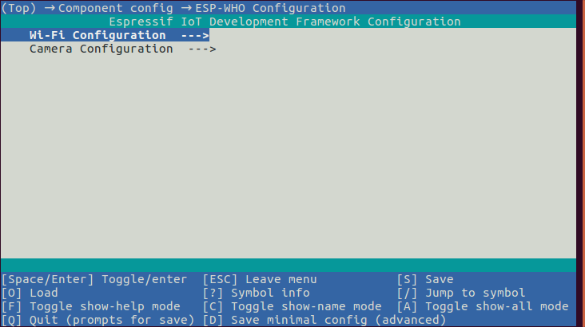
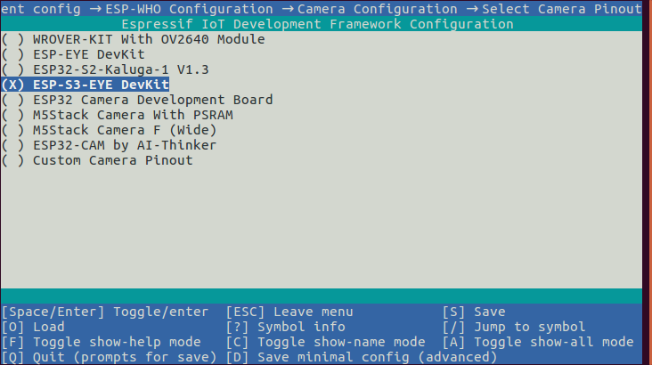

# ESP-WHO

ESP-WHO 是基于乐鑫芯片的图像处理开发平台。其中包含了实际应用中可能出现的开发示例。

## 概述

ESP-WHO 提供了例如人脸检测、人脸识别、猫脸检测和手势识别等示例。您可以基于这些示例，衍生出丰富的实际应用。ESP-WHO 的运行基于 ESP-IDF。[ESP-DL](https://github.com/espressif/esp-dl) 为 ESP-WHO 提供了丰富的深度学习相关接口。配合各种外设可以实现许多有趣的应用。

<p align="center">
     
</p>


## 准备工作

### 硬件

我们推荐新手开发者使用乐鑫设计的开发套件。ESP-WHO 提供的示例是基于以下开发套件开发的。开发套件与芯片的对应关系如下表所示。
    
|    SoC    | [ESP32](https://www.espressif.com/zh-hans/products/socs/esp32) | [ESP32-S2](https://www.espressif.com/zh-hans/products/socs/esp32-s2) | [ESP32-S3](https://www.espressif.com/zh-hans/products/socs/esp32-s3) |
| :-------: | :----------------------------------------------------------: | :----------------------------------------------------------: | :----------------------------------------------------------: |
| Kit Board | [ESP-EYE](https://www.espressif.com/zh-hans/products/devkits/esp-eye/overview) | [ESP32-S2-Kaluga-1 V1.3](https://docs.espressif.com/projects/esp-idf/zh_CN/latest/esp32s2/hw-reference/esp32s2/user-guide-esp32-s2-kaluga-1-kit.html) | [ESP-S3-EYE](https://www.espressif.com/zh-hans/products/devkits/esp-s3-eye/overview) |

> 对于上面未提及的开发套件，需要手动修改外设的管脚配置，例如摄像头、LCD 和按键等。

### 软件

#### 获取 ESP-IDF

ESP-WHO 的运行基于 ESP-IDF。关于获取 ESP-IDF 的细节，请参考 [ESP-IDF 编程指南](https://idf.espressif.com/)。

> 请使用最新的 esp-idf/master 分支。

#### 获取 ESP-WHO

```bash
git clone --recursive https://github.com/espressif/esp-who.git
```

> 不要忘记 `--recursive` 拉取 ESP-WHO 的所有 submodule。如果忘了，可以进入项目，通过 `git submodule update --init` 拉取和更新 submodule。

## 运行示例

ESP-WHO 的所有示例都存放在文件夹 [examples](./examples) 中。进入文件夹，可以看到以应用命名的文件夹，例如 `human_face_detection`、`cat_face_detection` 和 `motion_detection` 等。进入其中一个应用，比如进入 `human_face_detection`。可以看到几个以显示方式命名的文件夹，如 `terminal`： 结果显示在终端；`lcd`：结果显示在 LCD 屏上；`web` 结果显示在网页上。每个应用都包含一个 README 说明对各个开发条件的支持情况。

对于硬件准备中所提到的开发套件，所有示例都是开箱即用的。执行以下两个步骤即可运行示例。

### 步骤1：设定目标芯片

打开终端，进入一个示例（例如：examples/human_face_detection/lcd），设定目标芯片。

```bash
idf.py set-target [SoC]
```

将 [SoC] 替换成您的目标芯片, 例如 esp32，esp32s2，esp32s3。

### 步骤2：运行和监视

```bash
idf.py flash monitor
```

### 自定义配置

ESP-WHO 提供一些可配置的参数。在终端输入 `idf.py menuconfig` ，依次 (Top) -> Component config -> ESP-WHO Configuration 可进入 ESP-WHO 的配置界面，如下图所示：



#### 摄像头配置

进入摄像头配置，可以根据开发套件选择摄像头管脚配置，如下图所示：



如果管脚配置中，没有所使用的开发套件，请选择 ``Custom Camera Pinout``，并正确配置对应管脚，如下图所示：


#### Wi-Fi 配置（仅对使用 web 的示例有效）

进入 Wi-Fi 配置，可以对 Wi-Fi 进行配置，如密码等，如下图所示：


## 开发套件的默认二进制文件

各开发套件的默认二进制文件存放在文件夹 [default_bin](./default_bin) 中。可使用[烧写工具](https://www.espressif.com/zh-hans/support/download/other-tools)烧录二进制文件。


## 反馈

如果在使用中发现任何问题，请提交相关 [issue](https://github.com/espressif/esp-who/issues) ，我们将尽快予以答复。
